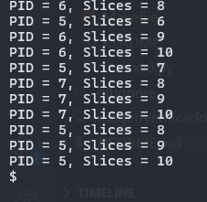

# Ignacio Soto Saniter y Benjamín Urrutia - Guía de pasos para la Tarea 2

En este markdown puede encontrar todos los pasos necesarios para realizar la tarea 2. Notar que todos estos pasos se ejecutaronen el bash o terminal de Ubuntu WSL.

## Instrucciones seguidas hasta detectar algún problema.

### 1) Primero fue necesario modificar la estructura del proceso, para ello se agregaron los campos de tickets y run slices en el proc.h

```h
int tickets;                 
int run_slices; 
```
### 2) En segundo lugar, fue necesario declarar el valor inicial de ambos cambios, para ellos se agregaron las siguientes lineas en proc.c, específicamente en la función allocproc():

```c
p->tickets = 100;          //Cantidad por defecto de tickets
p->run_slices = 0;         //Cantidad de run slices inicial de un proceso
```
### 3) Luego, se agregaron dos funciones al sysproc.c: La primera syscall es para setear el nro de tickets de un proceso mientras que la 2da es para obtener la cantidad de run slices que ha recibido el proceso.

```c
uint64
sys_settickets(void)  //Permite modificar la cantidad de tickets
{
  int tickets;                                                
  argint(0,&tickets);                                         

  if(tickets <= 0){
    tickets = 1;   //En caso de no ser positivo , se asigna 1 ticket
  }
  struct proc *curr_proc = myproc();
  
  if(curr_proc == (void*)0){
    return -1;  // Si falla, retorna -1

  }else{
    curr_proc->tickets = tickets;  //Asignar la cantidad de tickets al proceso actual
  }
  return 0;
}

uint64
sys_getslices(void) //New syscall to get the run_slices of the current process 
{
  return myproc()->run_slices; //Return the pid of the parent process
}

```

### 4) Para que las syscalls funciones correctamente se modificó el syscall.c, agregando las siguiente lineas asociadas a cada syscall:

```c
extern uint64 sys_settickets(void);
extern uint64 sys_getslices(void);
```
```c
[SYS_settickets] sys_settickets,
[SYS_getslices]  sys_getslices,
```
_Nota: Esto permite que las funciones declaradas sean llamadas. Por otro lado, las últimas dos líneas se agregaron en el arreglo de syscalls_

### 5) A su vez se modifico el syscall.h para declarar las funciones:
```h
#define SYS_settickets 22  
#define SYS_getslices  23  
```

### 6) Por último, para estas dos funciones se modifó el archivo user.h y el usys.pl para que el usuario las pueda usar. Se agregaron las siguientes líneas en user.h y usys.pl respectivamente:
```h
int settickets(int);  
int getslices(void);  
```
```pl
entry ("settickets");
entry ("getslices");
```

### 7) Para implementar el scheduler como tal, tambien se creó una función auxiliar que calcule el nro total de tickets. A continuación se puede observar esta función y el Lottery Scheduler implementado en el archivo de proc.c: 

```c
int sum_tickets(void) //función que calcula la cantidad total de tickets (sólo los que estan en estado runneable)
{
  struct proc *p;
  int sum = 0;
  for(p = proc; p < &proc[NPROC]; p++) {
    acquire(&p->lock);
    if(p->state == RUNNABLE) {
      sum += p->tickets;
    }
    release(&p->lock);
  }
  return sum;

}
//función que obtiene el ticket ganador de forma "aleatoria" por medio de una semilla
static
unsigned long rand_val(unsigned int *seed) {  // Generador de números LCG (Linear Congruential Generator) --> para nros pseudo-aleatorios
  unsigned long a = 1103515245, c = 12345;    // Números "mágicos" usados en glibc
  *seed = (a * (*seed) + c);                  // Crea un número grande que sobrepasa los 32 bits de unsigned int (toma su módulo 2^32)
  return *seed;
}


void
scheduler(void) //Lottery Scheduler 
{

  unsigned int seed = r_time();  //semilla usada en el generador de nros pseudo-aleatorios (se basa en el ciclo actual de la CPU)
  struct proc *p;
  struct cpu *c = mycpu();


  c->proc = 0;
  int winner_ticket = 0; //inicializa el ticket ganador en 0

  for(;;){ //durante la ejecución del scheduler 
    intr_on();
    intr_off();

    int found = 0; //varía a 1 si hay un proceso runnable para que lo ejecute la CPU
    int tickets_sum = sum_tickets(); //guarda la cantidad de ticket totales
    if(tickets_sum <= 0){ //si no hay tickets, no ejecuta proceso y continua el ciclo hasta que haya un proceso con tickets (siempre)
      continue;
    }
    winner_ticket = rand_val(&seed) % tickets_sum; //obtiene el ticket ganador por medio del modulo, de esta forma se asegura sacar un ticket entre 0 y el {nro de tickets-1}

    int acc = 0; //contador para saber que proceso es el ganador
    for(p = proc; p < &proc[NPROC]; p++) { //se recorren los procesos y se obtiene el ticket ganador que se asocia a un proceso
      acquire(&p->lock); //toma el lock para cambiar el estado del proceso y hacer el context switch correctamente
      if(p->state == RUNNABLE) {
        acc += p->tickets; 
        if(acc >= winner_ticket){ //se suman los tickets y se van acumulando por proceso hasta que sobre pase al ticket ganador (así se conoce el proceso ganador también)

          p->state = RUNNING; //se cambia el estado del proceso a running (del proceso que ganó)
          c->proc = p;
          p->run_slices += 1; //aumenta su run slice
          swtch(&c->context, &p->context); //context switch para cambiar al proceso ganador

          c->proc = 0;
          found = 1;
        }
      }
      release(&p->lock); //libera el lock
      if(found) {
        break;
      }

    }
    if(found == 0) { //nothing to run; stop running on this core until an interrupt. --> comentario de antes
      asm volatile("wfi");
    }
  }
}
```
Importante se eliminó el scheduler anterior para implementar este.

## Instrucciones seguidas para crear una función que pruebe y respalde la implementación del lottery scheduling.

Como se puede notar en el paso 5 de la sección anterior, la versión instalada de QEMU era menor a la necesaria para ejecutar `make qemu`. Es por ello que se realizaron los siguientes pasos.

### I) Primero se creó el demo.c en la carpeta de user que contiene el siguiente contenido:

```c
#include "kernel/types.h" 
#include "user.h" 

int main() {
  for(int i = 0; i < 10; i++){ //a modo de prueba, se hacen 10 forks para obtener 10 procesos y comparar su slices. 
                              //De esta manera, se demuestra que un proceso mantiene su PID mientras que su run slice aumenta.
    int pid = fork();
    if (pid < 0) {
      printf("Fork failed\n");
      exit(1);
    }else if (pid == 0) {
      settickets(50 * (i+1)); //se implementa la regla requerida por la tarea 
      int slices;
      int prev_slices = 0;
      while(1){ //este white permite que se pueda observar la cantidad de slices de un proceso y asegurar de que termine en algún momento
        slices = getslices();
        if(slices != prev_slices){ //si cambia la cantidad de slices, muestra y hace el print. De esta manera se evita que un proceso muestre constantemente el mismo print (con la misma cantidad de slices) 
          printf("PID = %d, Slices = %d\n", getpid(), slices);
          prev_slices = slices;
        }
        if(slices >= 10){  //Definimos que el proceso termine con 10, para no aumentar demasiado la cantidad de prints y que sea visible la implementación.
          break;
        }
      }
      exit(0);
    }
  }
  for(int i = 0; i < 10; i++){
    wait(0); //Espera que terminen los 10 forks
  }
  exit(0);
}
```

### II) Luego se debe agregar el demo a los programas del usuario para que así sea ejecutable. Para ello se debe modificar el Makefile, específicamente en UPROGS:

```Makefile
$U/_demo\
```


### III) Como el lottery scheduling esta configurado con una sola CPU, se debe compilar con ese parámetro.

```bash
make qemu CPUS=1
```
### IV) Después, si se hace ls y se obsera demo, es posible ejecutar el progroma de prueba con:

```bash
demo
```

## Captura de pantalla que demuestra la correcta implementación de lottery scheduling con demo:



## Dificultades encontradas y solución:

En concreto no se tuvieron grandes dificultades, sin embargo, hubo dificultades para implementar los números aleatorios sin el uso de rand al que se esta acostumbrado a utilizar. En un principio se buscó usar soluciones matemáticas complejas, pero se notó que no era el mejor camino para algo tan "sencillo" como lo que requería el scheduler. Al final se decidió usar la implementación de glibc (de forma manual) que consiste simplemente en multiplicar dos grandes números y sacar el módulo; este es un método que esta comprobado a nivel estadístico su eficacia.

## Posibles problemas de este tipo de Scheduler (Lottery Scheduling)

El primer problema que se notó es que no tiene políticas para múltiples CPUs (por lo menos, la implementación vista en este informe); Por ello no es muy útil aplicar este scheduler en la práctica, ya que los computadores modernos tienen múltples CPUs/núcleos/procesadores. Por otra parte, si bien este scheduler se enfoca en que los procesos reciban un porcentaje justo de CPU, en la práctica no necesariamente se puede observar un relación tan justa como la que se podría plantear con la cantidad de tickets (recordar que la cantidad de tickets refleja o espera representar el porcentaje de uso de la CPU). A su vez, la justica del lottery schduling depende en parte, de la extensión de los proceso (su duración), pues como se dijo en clase, mientras más extensos son los procesos, más justo es el scheduler. Un último problema que se podría identificar es como asignar la cantidad correcta de tickets a un proceso, para ello se debe conocer información futura o previa de un proceso, lo que puede ser costos o incluso imposible (no hay métodos exactos para determinar la cantidad de tickets).  

