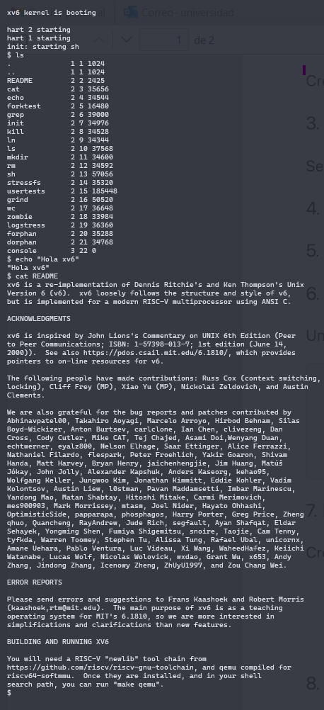

# Ignacio Soto y Benjamín Urrutia - Guía de pasos para instalar XV6 y QEMU

En este markdown puede encontrar todos los pasos necesarios para instalar XV6-riscv y QEMU. Notar que todos estos pasos se ejecutaronen el bash o terminal de Ubuntu WSL.

## Instrucciones seguidas hasta detectar algún problema.

### 1) Primero es necesario preparar el ambiente de WSL para instalar ambos programas. Para ello, hay que actualizar el ambiente con los siguientes comandos:

```bash
sudo apt update
sudo apt upgrade
sudo apt install -y build-essential git qemu-system-x86 qemu-system-misc gdb-multiarch
```

El último comando permitirá instalar todo lo necesario para compilar y correr xv6-riscv, incluyendo herramientas de desarrollo, control de versiones, el emulador QEMU y el depurador. Notar que no es `qemu-system`, sino que `qemu-system-misc` porque éste incluye QEMU para arquitecturas adicionales, como qemu-system-riscv64 (necesario para xv6-riscv).

_Nota: La parte de `gdb-multiarch` es opcional, ya que es depurador (en espífico, para arquitecturas no-x86 como riscv)._

### 2) Luego, hay que instalar el compilador para generar los binarios de riscv (versión a instalar), para ello hay que ejecutar el siguiente comando:

```bash
sudo apt install -y gcc-riscv64-unknown-elf
```

### 3) Una vez instalado el compilador, hay que instalar xv6-riscv. Para este paso es necesario usar el siguiente comando:

```bash
git clone https://github.com/mit-pdos/xv6-riscv.git
```

_Nota: este comando es brindado según el material del curso._

### 4) Para proceder a la compilación de xv6, dirijase al directorio de xv6-riscv con `cd xv6-riscv` y luego ejecute `make` para compilarlo.

Esto permitirá ejecutar el makefile del proyecto xv6, compilar todos los archivos fuente y generar el kernel que correrá en QEMU.

### 5) Luego, para ejecutar QEMU y abrir la consola de xv6 hay que hacer el siguiente comando:

```bash
make qemu
```
Importante saber que este comando carga el kernel que se generó con el `make` anterior, permitiendo la interacción con el sistema operativo.

**Nota importante (Problema encontrado):** Luego de ejecutar `make qemu`, se obtuvo el siguiente error

```
root@acer-nacho:/home/Universidad/SO/xv6-riscv# make qemu
ERROR: Need qemu version >= 7.2
```

## Instrucciones seguidas luego del problema para su resolución.

Como se puede notar en el paso 5 de la sección anterior, la versión instalada de QEMU era menor a la necesaria para ejecutar `make qemu`. Es por ello que se realizaron los siguientes pasos.

### I) Se instalan nuevas dependencias necesarias para QEMU y su creación de entornos virtuales:

```bash
sudo apt update
sudo apt install python3-venv
sudo apt install -y git libglib2.0-dev libfdt-dev libpixman-1-dev zlib1g-dev ninja-build pkg-config
```

### II) Hay que cambiarse de directorio (con un directorio detras de `/xv6-riscv` basta, es decir, se usa `cd ..`) y luego hay que ejecutar:

```bash
git clone https://gitlab.com/qemu-project/qemu.git
```

### III) Una vez clonado el repositorio, hay que avanzar al directorio de qemu con `cd qemu` y ejecutar `git checkout v8.2.0` para estar en una versión estable de QEMU.

### IV) Después, se debe crear un directorio de compilación:

```bash
mkdir build
cd build
```

### V) Luego, para configurar la compilación de QEMU (y compilar el emulador de riscv), se ejecuta:

```bash
../configure --target-list=riscv64-softmmu
```

### VI) Una vez configurado, se procede con la compilación (usando todos los núcleos):

```bash
make -j$(nproc)
```

### VII) Y luego, sigue la instalación:

```bash
sudo make install
```

### VIII) (Opcional) Se puede verificar que la versión de QEMU sea mayor a 7.2 con:

```bash
qemu-system-riscv64 --version
```

### IX) Por último, hay que dirijirse a `/xv6-riscv` y abrir la consola de xv6-riscv usando:

```bash
make qemu
```
## Captura de pantalla que demuestra instalación y uso
